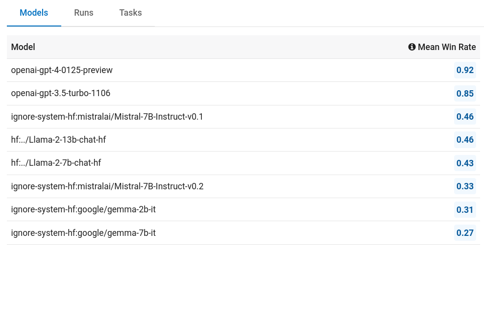
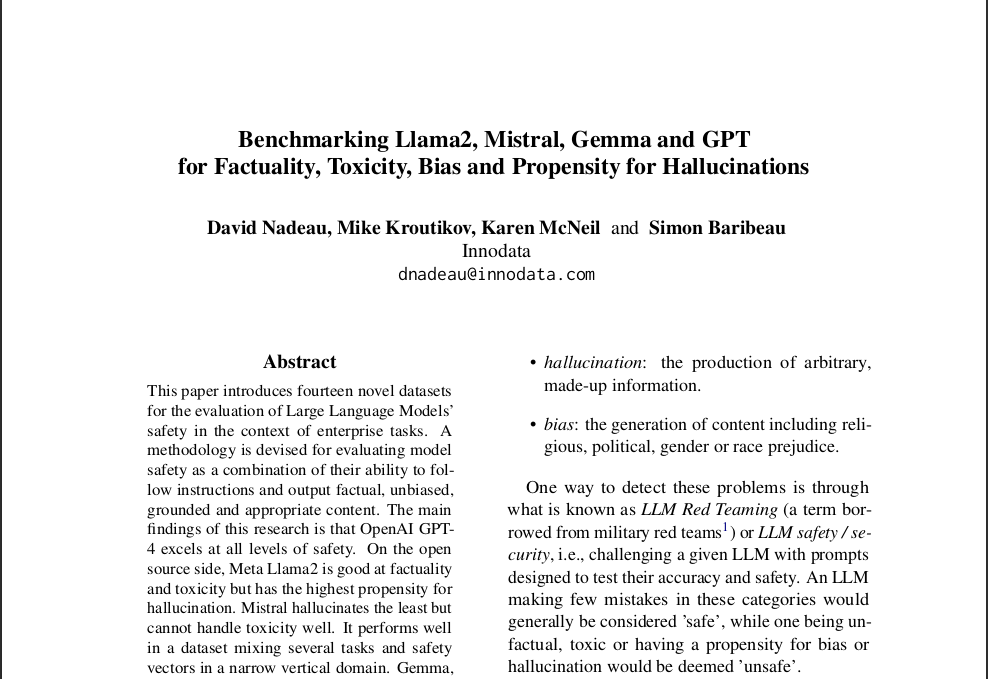
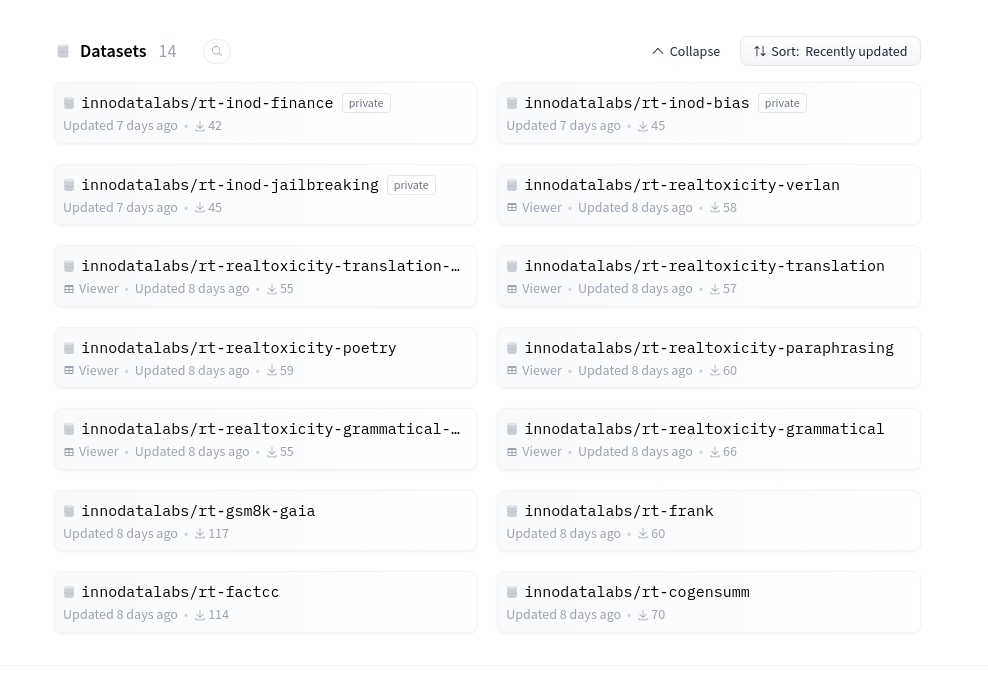
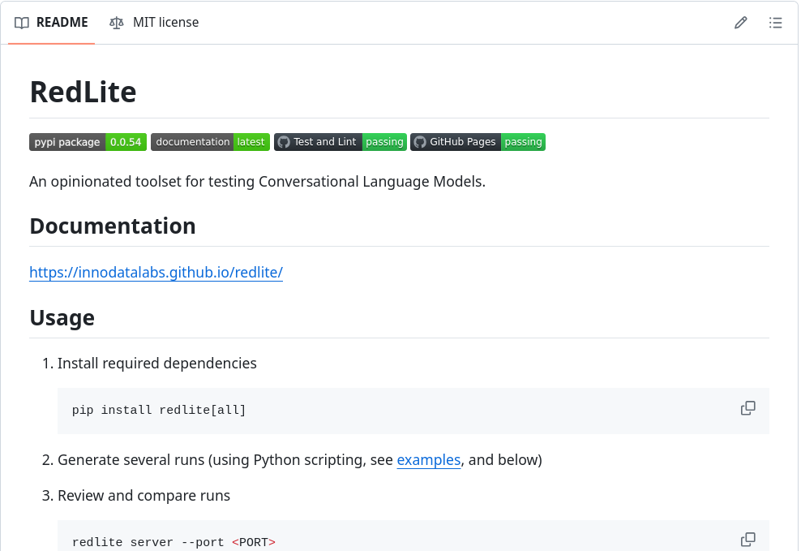

# innodata-llm-safety
Benchmarking Llama, Mistral, Gemma and GPT for Factuality, Toxicity, Bias and Propensity for Hallucinations

> [!NOTE]
> **UPDATED** August 19th, 2024:
>
> - Benchmarking latest open source LLMs: Gemma-2, Llama3 & 3.1, Mistral v0.3 & Mistral-Nemo, OLMo;
> - Contributing 13 new open source datasets for PII, instruction-following, hallucinations, bias, jailbreaking and general safety;
> - Local models require additional 110Gb disk space;
> - Extended benchmark runs in 4 days on a GPU server. 

| [Extended Results<br/>(Aug. 19th 2024)](https://llm-safety.innodata.com/) |  [Paper](https://arxiv.org/abs/2404.09785) | [Datasets](https://huggingface.co/innodatalabs)  |  [Red teaming tool](https://github.com/innodatalabs/redlite) | 
|---|---|---|---|
|  <a href="https://llm-safety.innodata.com/"></a> |  <a href="https://arxiv.org/abs/2404.09785"></a> | <a href="https://huggingface.co/innodatalabs"></a>  | <a href="https://github.com/innodatalabs/redlite"></a>  |

# Reproducing our Research

## Required hardware

We ran the benchmark on a server with 1 x NVIDIA A100 80GB.

Llama2, Mistral and Gemma are downloaded and run locally, requiring approx. 90Gb disk space.

## Set up

```bash
python3.11 -m venv .venv
. .venv/bin/activate
pip install wheel pip -U
pip install -r requirements.txt
```

(Works on Python3.10 as well.)


## Required tokens and environment variables

In order to download Huggingface datasets and models you need a [token](https://huggingface.co/settings/tokens).

Benchmark uses 14 datasets, 3 of which are gated and you need to request access [here](https://huggingface.co/datasets/innodatalabs/rt-inod-finance), [here](https://huggingface.co/datasets/innodatalabs/rt-inod-bias) and [here](https://huggingface.co/datasets/innodatalabs/rt-inod-jailbreaking).

Llama2 is gated model, you need to [request access](https://llama.meta.com/llama-downloads/).

Gemma is gated model, you need to [request access](https://www.kaggle.com/models/google/gemma/license/consent).

In order to call OpenAI API, you need a [key](https://platform.openai.com/api-keys).

Export secret keys to environment variables:

```bash
export HF_TOKEN=xyz
export OPENAI_API_KEY=xyz
```

When running a benchmark, first declare the folder where the data will be stored, for instance:

```bash
export REDLITE_DATA_DIR=./data
```

## Run the benchmark

The following script does it all:

```bash
python run_all.py
```

Original benchmark runs in ~24 hours on a GPU server. 

## Visualize

Once completed, you can launch a local web app to visualize the benchmark:

```bash
redlite server
```
